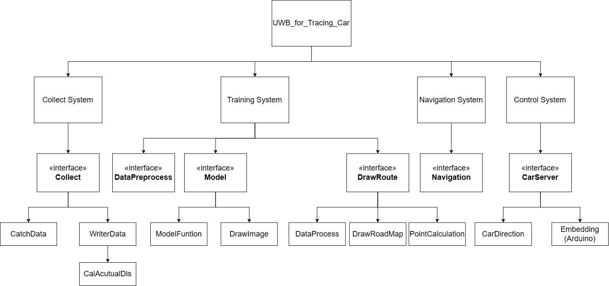
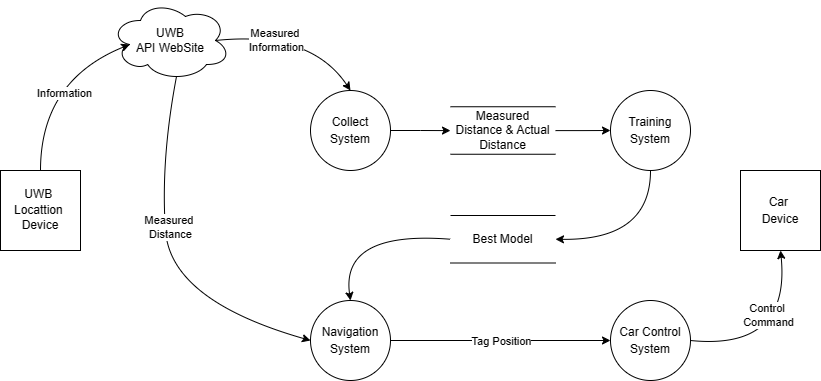
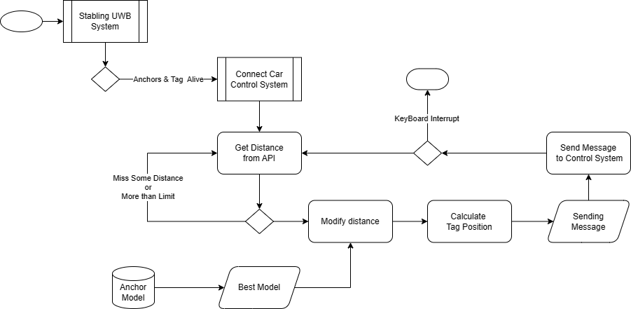

# UWB_rewrite


## 程式架構
 
### 資料流程圖
 
### 資料收集
```
    用來蒐集訓練模型所需資料程式，主程式為 collect.py. 
    利用執行緒(Tread)同時進行接收與寫入
```

<p>環境設定</p>
<ol> 
<li> ip: The API 地址 </li>
<li> (x, y, z, position): Andchor & Tag 位置</li>
<li> Direction: 移動方向</li>
<li> avgV: 移動速度</li>
<li> maxsNumber: 最大收集筆數</li>
<li> resultInfo: 資料存取資訊</li>
</ol>

  
### 模型訓練 
```
    找到適合的機器學習方法，對定位誤差進行修正
    1. 利用 DataPreprocess 對原始資料進行處理
    2. 執行 model.py 進行機器學習
    3. 將結果利用 DrawRoadMap.py 將各種方法修正的路徑畫出
```
<p>環境設定</p>
<ol>
<li>dataPreprocess</li>
    <ul> 
        <li> folder, train_datapath </li>
    </ul>
<li>model</li>
    <ul> 
        <li> excel: root, output </li>
    </ul>
<li>drawRoute</li>
    <ul>
        <li> x,y: same as collect </li>
        <li> root, excel forlder, savepath </li>
    </ul>
<li>Class</li>
    <ul>  
    <li> 
    DrawRoadmap: imgpath 
    </li>
    <li> 
    ModelFunction, excel path, anchor path
    </li>
    </ul>
</ol>


 
### 導航系統 
```
    主要工作為接收UWB定位系統的資料，並用機器學習修正誤差後，
    計算座標並傳至控制系統進行判斷處理
```
<p>環境設定</p>
<ul>
<li> ip, position, host ip, moveLimit </li>
</ul>

 
### 控制系統 
```
    接受到座標後，傳送指令至機械車，使其移動到座標位置
```
            